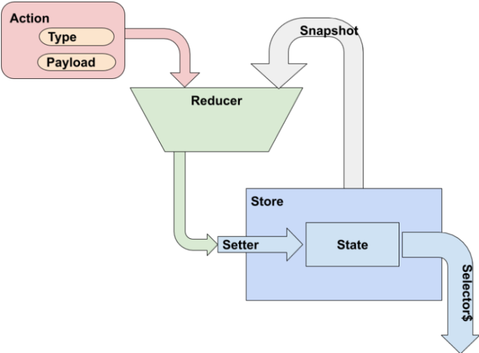

title: 4-Redux
class: animation-fade
layout: true

.bottom-bar[
{{title}}
]

---

class: impact

# {{title}}

## Redux: flujo reactivo unidireccional con Angular y RxJs

---

    # 1. Arquitectura del patrón Redux

    # 2. Implementación de un Store con RxJs

--

> Redux no hace rápido lo simple, sino mantenible lo complejo

---

class: impact

# 1 Arquitectura del patrón Redux

## Principios de Redux
## Elementos de Redux

---

```yaml
As a: devoloper,
  I want: to know what actions can be done
  so that: I can control the functionality

As a: developer,
  I want: to know what changes have been done
  so that: I can debug and predict behaviour
```

---

## 1.1 Principios de Redux

- **Single Source Of Truth**: Cada pieza de información se almacena en un único lugar, independientemente de dónde sea creada, modificada o requerida.

- **Read Only State**: La información será de sólo lectura y sólo podrá modificarse a través de conductos oficiales.

- **Changes By Pure Functions**: Los cambios tienen que poder ser replicados, cancelados y auditados; lo mejor, usar una función pura.

---

## 1.2 Elementos de Redux

- **Store**: El sistema que mantiene el estado. Despacha acciones de mutado sobre el mismo y comunica cambios enviando copias de sólo lectura a los subscriptores.

- **State**: Árbol de objetos que contienen la única copia válida de la información. Representa el valor del almacén en un momento determinado.Nunca expondremos un puntero a este dato privado.

---

### Acceso al estado

- **Setters** : Métodos que asignan y notifican un nuevo cambio. Clonan la información recibida para que el llamante no tenga un puntero al estado.

- **Selectors** : Métodos para consulta del estado. Devuelven un observable al que suscribirse para obtener notificaciones de cambio o una instantánea. En cualquier caso siempre emitirá o devolverá un clon del estado.

---

### Mutaciones del estado

- **Actions**: Objetos identificados por un tipo y cargados con un *payload*. Transmiten una intención de mutación sobre el estado del *store*.

- **Reducers** : Son funciones puras, que ostentan la exclusividad de poder mutar el estado. Reciben dos argumentos: el estado actual y una acción con su tipo y su carga. Clonan el estado, realizan los cambios oportunos y devuelven el estado mutado.

---


---

> Recap:

# 1 Arquitectura del patrón Redux

## Principios de Redux
## Elementos de Redux

---

class: impact

# 2 Implementación de un Store con RxJs

## El Store observable
## El envío de acciones
## La función reductora de estado
## La selección de suscripciones

---

```yaml
As a: seller,
  I want: to know how many products are out of stock
  so that: I can refill them

```

```
ng g @nrwl/workspace:library rx-store
```

---

```typescript
export class ApiProductsService {
  private readonly url = 'api/products';

  constructor(private httpClient: HttpClient) {}

  public getProducts$() {
    return this.httpClient.get<Product[]>(this.url);
  }

  public putProduct$(product: Product) {
    return this.httpClient.put(this.url, product);
  }
}
```

---

## 2.1 El Store observable

Single-file Redux store
```
ng g s core/out-of-stock-store --project=warehouse

```

```typescript
export interface OutOfStock {
  products: Product[];
}
export const OutOfStock_Initial_State: OutOfStock = { products: [] };
```

---

```typescript
export class OutOfStockStoreService {
  private state: OutOfStock = OutOfStock_Initial_State;
  private state$: BehaviorSubject<OutOfStock> = new BehaviorSubject(this.snapShot());

  constructor() {}

  public snapShot(): OutOfStock {
    return { ...this.state };
  }
  public select$(): Observable<OutOfStock> {
    return this.state$.asObservable();
  }
  public dispatch(action: ImAction) {
    this.state = reducer(this.state, action);
    this.state$.next(this.snapShot());
  }
}
```


---

## 2.2 El envío de acciones


```typescript
export interface ImAction {
  type: string;
  payload: any;
}
export class AddOoSProduct implements ImAction {
  public readonly type = 'Add Out of Stock Product';
  constructor(public readonly payload: Product) {}
}
export class RemoveOoSProduct implements ImAction {
  public readonly type = 'Remove Out of Stock Product';
  constructor(public readonly payload: Product) {}
}
```

---

```typescript
export class ProductsService {
  private readonly minimalStock = environment.minimalStock;
  constructor(
    private apiProductsService: ApiProductsService,
    private outOfStockStoreService: OutOfStockStoreService
  ) {}
  public getProducts$() {
    return this.apiProductsService.getProducts$().pipe(
      tap(products => {
        products.forEach(product => {
          if (product.stock <= this.minimalStock) {
            const addOutOfStockAction = new AddOoSProduct(product);
            this.outOfStockStoreService.dispatch(addOutOfStockAction);
          }
        });
      })
    );
  }
  public refill(product: Product) {
    product.stock += environment.minimalStock;
    this.apiProductsService.putProduct$(product).subscribe(() => {
      const removeOutOfStockAction = new RemoveOoSProduct(product);
      this.outOfStockStoreService.dispatch(removeOutOfStockAction);
    });
  }
}
```

---

## 2.3 La función reductora de estado

```typescript
function reducer(state: OutOfStock = OutOfStock_Initial_State, action: ImAction): OutOfStock {
  const result = { ...state };
  const product = action.payload;
  switch (action.type) {
    case 'Add Out of Stock Product':
      if (result.products.find(p => p._id === product._id) === undefined) {
        result.products = [...result.products, product];
      }
      break;
    case 'Remove Out of Stock Product':
      result.products = result.products.filter(p => p._id !== product._id);
      break;
    default:
      break;
  }
  return result;
}
```

---

## 2.4 La selección de suscripciones

```typescript
  constructor(
    private breakpointObserver: BreakpointObserver,
    private outOfStockStoreService: OutOfStockStoreService
  ) {
    this.numberOfProductsOutOfStock$ = this.outOfStockStoreService
      .select$()
      .pipe(map(state => state.products.length));
  }
```

--

```typescript
 public ngOnInit() {
  this.productsOutOfStock$ = this.outOfStockStoreService
    .select$()
    .pipe(map(store => store.products));
  this.productsService.getProducts$().subscribe();
}
```

---

> Recap:

# 2 Implementación de un Store con RxJs

## El Store observable
## Las acciones
## El reductor
## Tipado estricto

---

> Next:

# Redux con NgRx

## Instalación y configuración
## Actions
## State reducer
## Selectors
## Effects


> **Blog de apoyo:** [Detección del cambio en Angular](https://academia-binaria.com/deteccion-del-cambio-en-Angular/)

> > By [Alberto Basalo](https://twitter.com/albertobasalo)
