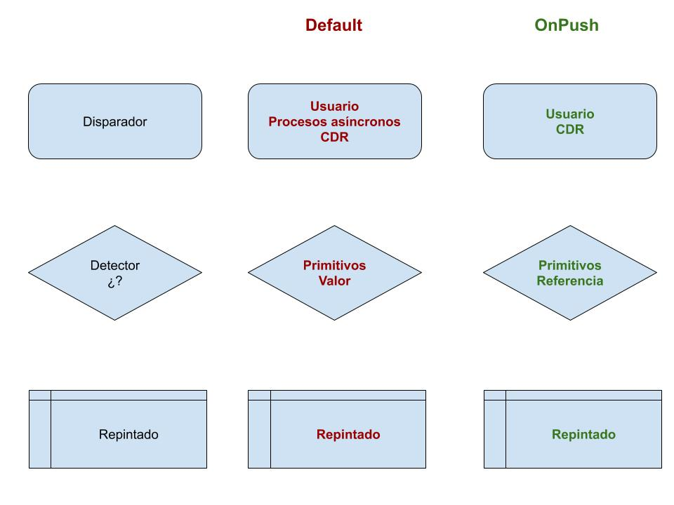

# Detección del cambio en Angular

La forma en que Angular realiza su renderizado y actualiza sus vistas es un factor clave para el rendimiento de las aplicaciones. ¿Cómo funciona la estrategia de detección de cambios de Angular? Pues tiene dos modos: `default` o *automágico* y `onPush` o *mindfulness*.

> Es importante tomar consciencia sobre el proceso y las implicaciones. Es costoso realizar la detección más veces de lo necesario y  no hacerlo suficientemente implica no ver resultados reales.

Afortunadamente el cambio del modo automático al manual no tiene por qué ser traumático. Con un mayor conocimiento del `changeDetectionStrategy` y un poco de trabajo extra tendrás aplicaciones más eficientes y mantenibles.

Partiendo de la aplicación tal cómo quedó en [Tests unitarios con Jest y e2e con Cypress en Angular](../tests-unitarios-con-jest-y-e2e-con-cypress-en-Angular/). Al finalizar tendrás una aplicación que actualiza la vista sólo cuando es necesario, es decir: cuando los datos han cambiado.

> Código asociado a este tutorial en _GitHub_: [AcademiaBinaria/angular-boss](https://github.com/AcademiaBinaria/angular-boss)


# 1 Comunicación de datos entre componentes

```yaml
As a: customer,
  I want: to see a shopping cart page
  so that: i can browse the list of products in my basket

As a: customer,
  I want: to pick a product
  so that: I can add units to my basket

As a: customer,
  I want: to remove a product from my basket
  so that: I can take less units

As a: customer,
  I want: to see always counters of my basket
  so that: I can know what I'm buying
```

Sigue la pista al código de ejemplo creado a partir de estos comandos:

```terminal
ng g m cart --project=shop --module=app.module.ts --routing --route=cart
```

`apps\shop\src\app\app.component.html`

```html
<nav>
  <a [routerLink]="['/cart']">Basket</a>
</nav>
```

```terminal
ng g c cart/item-picker --project=shop
ng g c cart/basket-list --project=shop
ng g s basket --project=shop
```

La detección de cambios se dispara ante eventos que le ocurren a los componentes. **La detección se realiza componente a componente**, así que compensa tener muchos componentes pequeños, para que cada uno por si sólo no genere demasiado ruido.

## 1.1 Componentes Contenedores y Presentadores

Al pasar de un único componente a varios mini-componentes, se propone usar **el patrón contenedor / presentadores**. Se mantiene un componente padre que contiene múltiples componentes presentadores hijos. El contendor es el único con acceso a los servicios de negocio y datos. Los presentadores reciben los datos y emiten eventos. Los presentadores no obtienen ni modifican datos por su cuenta.

Nomenclatura
- **Container**: aka *Parent, Smart*. `AppComponent` y `CartComponent`
- **Presenter**: aka *Child, Dumb*. `ItemPickerComponent` y `BasketListComponent`

> Este reparto de responsabilidades es aconsejable independientemente de la estrategia de detección aplicada. Tienes más información el artículo de introducción [flujo de datos entre componentes](../flujo-de-datos-entre-componentes-angular).

# 2 Change detection strategies

Con la aplicación bien estructurada en componentes y con la comunicación estandarizada, habremos reducido el impacto de la detección del cambio y estaremos preparados para optimizarlo. Conozcamos en detalle las estrategias de detección del cambio.

El decorador `@Component()` admite en su configuración la poco conocida propiedad `changeDetection`. Dicha propiedad puede asignarse manualmente al componente, o indicarle su uso al generador del cli.

## 2.1 Detección automática, *default*

Por defecto, Angular tiene que ser conservador y verificar cada posible cambio, esto se denomina comprobación sucia o *dirty checking*. Se dispara **con demasiada frecuencia**, al menos en los siguientes casos:

- Eventos desde el browser
- Timers, intervals etc..
- Llamadas http
- Promesas y código asíncrono.

Por si fuera poco, además de dispararse mucho es **muy costoso**. Determinar que algo ha cambiado implica comparar dos estados: el actual y el anterior.

> La comparación es valor a valor, en profundidad, para cada propiedad de cada objeto, para cada objeto de cada array.

Con todo, esta estrategia es cómoda para el programador y suficiente para casos básicos. Pero demasiada magia dificulta el control en aplicaciones complejas. Y en pantallas de mucha información e interacción degrada el rendimiento percibido.

## 2.2 Detección manual, *onPush*

Como se puede prever, la detección del cambio manual es lanzada por el programador. No siempre va a ser laborioso, pero será más consciente pues para que ocurra han de darse alguna de estas circunstancias:

- **Explícitamente** el programador solicita la detección llamando a `ChangeDetectorRef.detectChanges();
- **Implícitamente** al usar el `pipe Async` en la vista se llama a ese mismo método.
- **Conscientemente** el desarrollador obliga a un componente a repintarse si le cambia la referencia a un `@Input()`.

> En este modo los componentes dejan de evaluar y comparar sus propiedades rutinariamente. Sólo atienden a eventos `@Output()` o **cambios de referencia** `@Input()`. Esto relaja mucho al motor de Angular, que ya no tiene que hacer comparaciones odiosas. Sabrá que algo ha cambiado porque... es otro objeto.

# 3 Inmutabilidad

Como ya se ha dicho, para que Angular en la estrategia automática decida que algo ha cambiado necesita hacer una comparación por valor. Para evitar ese coste usamos la estrategia manual y el programador tiene que cambiar la referencia de algo cuando quiera que Angular repinte la vista.

## 3.1 Por referencia y por valor

Normalmente tendrá que crear un nuevo objeto y reasignarlo en lugar del anterior en un **ciclo de clonación, mutación y asignación**. Por costoso que parezca siempre compensa si evita muchas e innecesarias comparaciones por valor en estructuras profundas.

La estrategia `onPush` trata a todos los `Inputs` en inmutables, es decir, algo que no espera que cambie. Similar al paso de parámetros por valor, que si cambia es porque es otro puntero.

## 3.2 El clonado
El potencialmente pesado trabajo de clonado lo podemos evitar en muchos casos usando alguna de estas técnicas:

- **Tipos primitivos** que se pasan por valor en las propiedades `@Input()`
- **Arrays**: muchos métodos como `.filter() .slice() .sort() .concat()` etc., devuelven nuevas referencias sin modificar el array original.
- **Observables y el pipe Async**, pues en este caso se subscribe y lanza implícitamente la detección del cambio. No hay necesidad de clonar todo lo que llega por _http_.

Para los demás casos tenemos operadores *TypeScript* sencillos y optimizados para obtener nuevas referencias a partir de otros ya existentes.

```typescript
// js cloning techniques
const original = { name:'first', value:1 };
const cloned = { ...original };
// > { name:'first', value:1 }
const mutated = { ...original, value:2, newProperty: 'added' };
// > { name:'first', value:2, newProperty: 'added' }
const list = [ original, cloned, mutated ];
// > [ { name:'first', value:1 }, { name:'first', value:1 }, { name:'first', value:2, newProperty: 'added' } ]
const clonedList = [ ...list ];
// > [ { name:'first', value:1 }, { name:'first', value:1 }, { name:'first', value:2, newProperty: 'added' } ]
const mutatedList = [ ...list, { name: 'new item'} ];
// > [ { name:'first', value:1 }, { name:'first', value:1 }, { name:'first', value:2, newProperty: 'added' }, { name: 'new item'} ]
const newList = list.filter(i => i.name=='first');
// > [ { name:'first', value:1 }, { name:'first', value:1 }, { name:'first', value:2, newProperty: 'added' } ]
```

Ya tienes los conocimientos para acelerar y reducir la incertidumbre sobre el actualización de vistas usando el patrón **contenedor / presentador** junto con la estrategia de detección de cambios `OnPush`. Ahora vamos a ver un ejemplo.


## 3.3 Todo reactivo.

```yaml
 Como: desarrollador
  quiero: que las comunicaciones sean fluidas e independientes del tiempo
  para que: los cambios en los datos cambien la presentación sin esfuerzo
```

Otro de los pilares de la programación moderna de grandes aplicaciones es la **reactividad** (nada que ver con Chernóbil). Se trata de que los cambios se comuniquen cuando ocurran, sin necesidad de preguntar por ellos. De esta forma **los componentes reaccionarán al cambio** en lugar de buscarlo proactivamente mejorando mucho el rendimiento de las aplicaciones.

Reducida a lo esencial, la lógica más básica que quiero comunicar es un contador de elementos y la propia cesta. Un mísero número y un array. Pero claro, hacerlo reactivo requiere usar observables, y para eso emplearemos la librería [RxJs](https://www.learnrxjs.io/concepts/rxjs-primer.html).

---

## Diagramas

El siguiente diagrama nos muestra a vista de pájaro los procesos que sique Angular para la detección del cambio y sus dos estrategias.


---

## Resumen

### OnPush es más ligero

- Se lanza menos veces

- Sólo comprueba referencias, no valores


### Async, CDR y clone detectan los cambios

- **`Async`:** para que las respuestas desde observables sean limpias

- **_CDR_:** cuando el cambio venga de procesos asíncronos pero no observables

- **_Clonado_:** para detectar los cambios simplemente en las referencias

La detección automática es cómoda pero costosa. Por dos razones: se dispara muchas veces y necesita comprobar si hay cambios comparando valor por valor. La detección manual es más eficiente. Se lanza menos veces y además le basta un cambio de referencia para saber que hay novedades. Para poder usarla sin grandes trabajos recomiendo usar el _pipe_ `async`, siempre con orígenes de datos observables.

Para ello necesitamos usar y conocer patrones que hagan uso de la librería observable _RxJs_. En este tutorial de formación [avanzada en Angular](../tag/Avanzado/) te muestra como mejorar el rendimiento usando el [Flujo reactivo unidireccional con Angular y RxJs](../flujo-reactivo-unidireccional-con-Angular-y-RxJs).

> Aprender, programar, disfrutar, repetir.
> -- <cite>Saludos, Alberto Basalo</cite>
