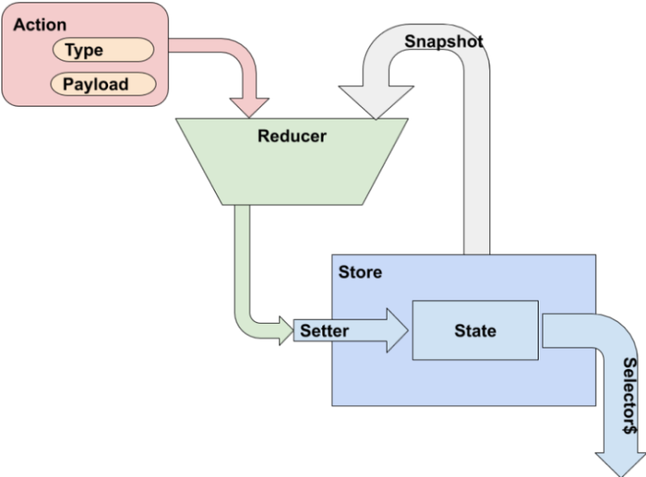

# Redux, flujo reactivo unidireccional con Angular y RxJs

Continuando con el **tutorial de Angular Avanzado** nos centramos ahora en una arquitectura de comunicación de datos conocida como _Unidirectional Data Flow_ o flujo de datos en un mismo sentido. Esta técnica es una mejora sobre el modelo básico de Angular, el _double-binding_, el cual facilitaba mucho el desarrollo en pequeños proyectos.

> Cuando hablamos de mejora debemos ser honestos con los costes y beneficios: aquí vamos a mejorar la eficiencia en ejecución y a facilitar la depuración a costa de una mayor complejidad estructural y sintáctica. Merece la pena cuanto más grande sea el proyecto. Este es un ejemplo simplificado pero realista. Tómate tu tiempo para estudiarlo con calma.

Tomar las decisiones correctas en cuestiones de este calibre puede suponer la diferencia entre el éxito o fracaso de un proyecto. Voy a explicarte las razones para usar este patrón y la manera más sencilla de introducirlo en tus aplicaciones, dejándote en el umbral de soluciones aún más potentes como la gestión de estado centralizada con Redux.

Partiendo de la aplicación tal cómo quedó en [componentes dinámicos, directivas y pipes con Angular](../componentes-dinamicos-directivas-y-pipes-con-Angular). Al finalizar dotaremos a la aplicación de un almacén de datos que notifica cambios reactivos.

> Código asociado a este tutorial en _GitHub_: [AcademiaBinaria/angular-boss](https://github.com/AcademiaBinaria/angular-boss)


# 1. Arquitectura del patrón Redux

```yaml
Como: desarrollador,
   Quiero: saber qué acciones se pueden hacer
   para que: pueda controlar la funcionalidad

Como: desarrollador,
   Quiero: saber qué cambios se han realizado
   para que: pueda depurar y predecir el comportamiento
```

Hablar de _Unidirectional Data Flow_ sin presentar **_Redux_** es poco menos que imposible. Vamos a ver en qué consiste este patrón tan usado, no sólo en Angular. Lo que aprendas te servirá también para _react_, _vue_ y otros.

**Redux se ocupa de la gestión del estado**, es decir, del valor de las variables en un determinado momento. Centraliza sus cambios para saber qué ocurrió para llegar a este valor, y qué valor tendrá según lo que ocurra. Desacopla los emisores de acciones de los receptores de información, para ello combina otros dos patrones:

- **Action:** Envío de comandos al almacén para actualizar el estado

- **Observable:** Subscripción a cambios en el estado del almacén.

Como incorpora cierta complejidad de serie conviene que nos hagamos esta pregunta ¿Cuándo usarlo?. Una pequeña lista de ideas sobre cuándo implementar Redux.

- Aplicaciones complejas con **múltiples componentes**.
    - El patrón contenedor / presentadores se hace complejo y tedioso a partir de tres niveles de profundidad del árbol.
    - Los `router-outlets` inician una jerarquía propia. Comunicar componentes entre árboles no es factible con `@Input` y `@Output`
- Uso de estrategias de **detección del cambio OnPush**.
    - Consumo de datos mediante _pipes async_ suscritos a observables.
- **Cambios concurrentes** por el usuario y los servicios.
    - Peticiones mediante _pull_ a intervalos regulares
    - Recepción de _sockets_
    - Llamadas en paralelo
- Gestión de datos local con _cachés_

> Redux no hace rápido lo simple, sino mantenible lo complejo.

---

## 1.1 Principios de Redux

Tenemos tres principios básicos que cumplir:

- **Single Source Of Truth**: Cada pieza de información se almacena en un único lugar, independientemente de dónde sea creada, modificada o requerida.
- **Read Only State**: La información será de sólo lectura y sólo podrá modificarse a través de conductos oficiales.
- **Changes By Pure Functions**: Los cambios tienen que poder ser replicados, cancelados y auditados; lo mejor, usar una función pura.

---

## 1.2 Elementos de Redux

Los artificios fundamentales que incorporaremos a nuestro desarrollo van en dos niveles. El primer nivel resuelve los dos primeros principios.

- **Store**: El sistema que mantiene el estado. Despacha acciones de mutado sobre el mismo y comunica cambios enviando copias de sólo lectura a los subscriptores.
- **State**: Objeto que contiene la única copia válida de la información. Representa el valor del almacén en un momento determinado. Nunca expondremos un puntero a este dato privado.

### Acceso al estado

- **Setters** : Métodos que asignan y notifican un nuevo cambio. Clonan la información recibida para que el llamante no tenga un puntero al estado.

- **Selectors** : Métodos para consulta del estado. Devuelven un observable al que suscribirse para obtener notificaciones de cambio o una instantánea. En cualquier caso siempre emitirá o devolverá un clon del estado.

### Mutaciones del estado

- **Actions**: Objetos identificados por un tipo y cargados con un *payload*. Transmiten una intención de mutación sobre el estado del *store*.

- **Reducers** : Son funciones puras, que ostentan la exclusividad de poder mutar el estado. Reciben dos argumentos: el estado actual y una acción con su tipo y su carga. Clonan el estado, realizan los cambios oportunos y devuelven el estado mutado.



Podemos verlo en un diagrama antes de pasar a verlo en código.


# 2. Implementación de un Store con RxJs

```yaml
As a: seller,
  I want: to know how many products are out of stock
  so that: I can refill them
```

Para que veas que **Redux es independiente de Angular**, vamos a montarlo en una librería sin dependencias del _framework_. **Sólo TypeScript y RxJs**. A día de hoy ambas tecnologías son transversales al ecosistema _frontend_.

```
ng g @nrwl/workspace:library rx-store
```

---

## 2.1 El Store observable mínimo

Empezaremos por la implementación más inocente de un almacén reactivo. Una clase con [tipos genéricos](https://www.typescriptlang.org/docs/handbook/generics.html) que hace uso de la librería de observables RxJs. De esta, toma el `BehaviorSubject` que permite notificar cambios y valores iniciales.

Aunque para evitar que otra clase consumidora también emita sin control, sólo exponemos su interfaz `asObservable()`. Relacionado con esto también es obligatorio evitar a toda costa punteros al estado. Para ell siempre trabajamos con clones. Los métodos `get() set()` usan el [spread operator](https://developer.mozilla.org/en-US/docs/Web/JavaScript/Reference/Operators/Spread_syntax) de JS `{ ...this.state }` tanto al recibir como al devolver el valor del estado.

`libs\rx-store\src\lib\mini-store.ts`

```typescript
import { BehaviorSubject, Observable } from 'rxjs';

export class MiniStore<T> {
  private state: T;
  private subject$ = new BehaviorSubject(this.get());

  constructor(initialState: T) {
    this.set(initialState);
  }
  public set(newSate: T) {
    this.state = { ...newSate };
    this.subject$.next(this.get());
  }
  public select$(): Observable<T> {
    return this.subject$.asObservable();
  }
  private get(): T {
    return { ...this.state };
  }
}
```
Puedes ver su uso en los test unitarios que le acompañan en `libs\rx-store\src\lib\rx-store.spec.ts`.

```typescript
import { MiniStore } from './mini-store';
describe('GIVEN: a basic mini-store of  product stocks', () => {
  interface ProductStock { stock: number; }
  const initial: ProductStock = { stock: 25 };
  describe('WHEN: I start one ', () => {
    const stockMiniStore = new MiniStore<ProductStock>(initial);
    it('THEN: it should have the inital value', done => {
      stockMiniStore.select$().subscribe(res => {
        expect(res).toEqual(initial);
        done();
      });
    });
  });
  describe('WHEN: I start and set a new value ', () => {
    const stockMiniStore = new MiniStore<ProductStock>(initial);
    stockMiniStore.set({ stock: 40 });
    it('THEN: it should emit the same value', done => {
      stockMiniStore.select$().subscribe(res => {
        expect(res).toEqual({ stock: 40 });
        done();
      });
    });
  });
});
```
---

## 2.2 El envío de acciones

En una situación más realista y aproximada al patrón Redux **no deberíamos asignar el valor de manera directa**, pues hay que dejar rastro de cómo se llegó ahí. Necesitamos entonces los conceptos de acciones y función reductora. La idea es que el almacén reciba acciones, invoque al reductor y asigne el valor obtenido. Vamos a verlo.

Empezamos por crear otra clase similar `libs\rx-store\src\lib\rx-store.ts` y un par de ayudas. Como mínimo el _interface_ que debe cumplir toda `Action`; es muy sencillo y siempre igual: una cadena para especificar el comando y cualquier cosa como argumento de carga. Aprovechando las potencia del TypeScript también creamos un _type_ para asegurar que la `reducerFunction` tiene la firma adecuada. La obligamos a recibir como argumentos el estado actual y la acción que se le aplica; teniendo que devolver el nuevo estado.

```typescript
import { BehaviorSubject, Observable } from 'rxjs';

export interface Action {
  type: string;
  payload: any;
}

export type reducerFunction<T> = (state: T, action: Action) => T;

export class RxStore<T> {
  private state: T;
  private subject$ = new BehaviorSubject<T>(this.get());

  constructor(initialState: T, private reducer: reducerFunction<T>) {
    this.set(initialState);
  }
  public select$(): Observable<T> {
    return this.subject$.asObservable();
  }
  public dispatch(action: Action) {
    const curretState = this.get();
    const newState = this.reducer(curretState, action);
    // instrumentation, cache, log...
    this.set(newState);
  }
  private get(): T {
    return { ...this.state };
  }
  private set(newSate: T) {
    this.state = { ...newSate };
    this.subject$.next(this.get());
  }
}
```

Como puedes ver, los `get()` y `set()` son ahora privados. El mundo exterior nos envía acciones al método `public dispatch(action: Action)`.  Ese sería un buen momento para incluir lógica de infraestructura e instrumentación. Hay quien  crea un _log_ de lo ocurrido, un histórico de valores... las librerías profesionales nos dan todo eso y mas. Una vez recibida la acción empieza la fiesta de los _clones_ invocando en medio a una función reductora que ahora veremos.

---

## 2.3 La función reductora de estado

En el fichero de _test_ `libs\rx-store\src\lib\rx-store.spec.ts` tenemos un ejemplo clarificador :

```typescript
const stockReducer: reducerFunction<ProductStock> = function(
    state: ProductStock,
    action: Action
  ): ProductStock {
    const clonedState = { ...state };
    switch (action.type) {
      case 'set':
        clonedState.stock = action.payload;
        break;
      case 'increment':
        clonedState.stock += action.payload;
        break;
      default:
        break;
    }
    return clonedState;
  };
```
Definimos `stockReducer` como una [**función pura**](https://www.freecodecamp.org/news/what-is-a-pure-function-in-javascript-acb887375dfe/) que cumple con el tipo `reducerFunction`. Normalmente estas funciones tienen un _switch_ que evalúa el tipo de la acción. En cada caso se asigna un nuevo estado según la mínima lógica oportuna y al finalizar se devuelve el estado mutado.

Veamos el resto del _test_ para tener una idea de cómo se utiliza.

```typescript
describe('WHEN: I get an increment ', () => {
  const stockRxStore = new RxStore<ProductStock>(initial, stockReducer);
  const incrementAction: Action = { type: 'increment', payload: 5 };
  stockRxStore.dispatch(incrementAction);
  it('THEN: it should raise the stock', done => {
    stockRxStore.select$().subscribe(res => {
      expect(res).toEqual({ stock: 30 });
      done();
    });
  });
});
```

De esta forma ya tenemos un sistema sencillo pero del que podríamos decir que cumple con los principios básicos de Redux.

## Resumen

Las aplicaciones reales no son sencillas. Este es un tutorial avanzado que te exige conocimiento previo y dedicación. A cambio espero que te resulte útil y que podáis incorporar las técnicas de detección del cambio y control de estado observable en vuestros proyectos.

Con este tutorial continúas tu formación [avanzada en Angular](../tag/Avanzado/) para poder afrontar retos de tamaño industrial.

> Aprender, programar, disfrutar, repetir.
> -- <cite>Saludos, Alberto Basalo</cite>
